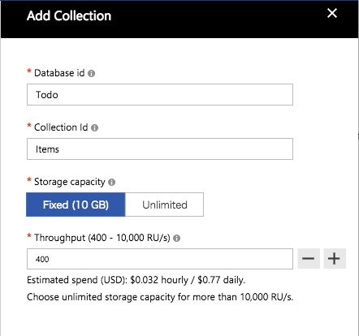

# Module1: Azure Cosmos DBの作成

## 1. Azure Cosmos DBの作成

1. Azureポータルにて、 **新規** > **Databases** > **Azure Cosmos DB** をクリックします。

1. **新規アカウント** 作成画面では以下を参考に設定して下さい。

    * ID: 任意のユニークな文字列（半角英数小文字とハイフンのみ）このIDが接続文字列のURLになる。
    * API: **SQL** を選択（[What's SQL API](https://docs.microsoft.com/ja-jp/azure/cosmos-db/sql-api-introduction))）
    * サブスクリプション: ハンズオン用に用意したサブスクリプション
    * リソースグループ: [module0](module0.md)で作成したリソースグループを選択（新規作成しない）
    * 場所: 東日本か西日本（選択できなければ他の場所、できればリソースグループの場所と同一にする）
    * **Geo 冗長の有効化** のチェックはここでは一旦外しておく

    **作成** をクリックします。

1. デプロイが完了するまで数分待ちます。

    画面右上の通知領域でデプロイ状況がわかりますので、データベースアカウントが作成できたことを確認します。

## 2. コレクションの作成

1. 全体メニューで **Azure Cosmos DB** をクリックし、作成したデータベースアカウントを選択します。

    全体メニューに表示されない場合は、メニュー一番下「その他サービス」から探し、スターを付けておきます。

1. **Azure Cosmos DB アカウント** ブレードにて、 **データエクスプローラー** > **New Collection** をクリックします。

1. Add Collection画面では以下のように設定して下さい。

    * Database id: **Todo**
    * Collection id: **Items** ※ Collectionがデータ格納/課金の単位
    * Storage capacity: **Fixed (10GB)** を選択
    * Throughput: **400** ※ デフォルトで 5000 が設定されているので注意

    大文字、小文字の使い分けは任意ですが、クライアントアプリケーションの設定値等にも影響しますので、注意して下さい。

    

1. **OK** をクリックします。

---
[Back](module0.md) | [Next](module2.md)