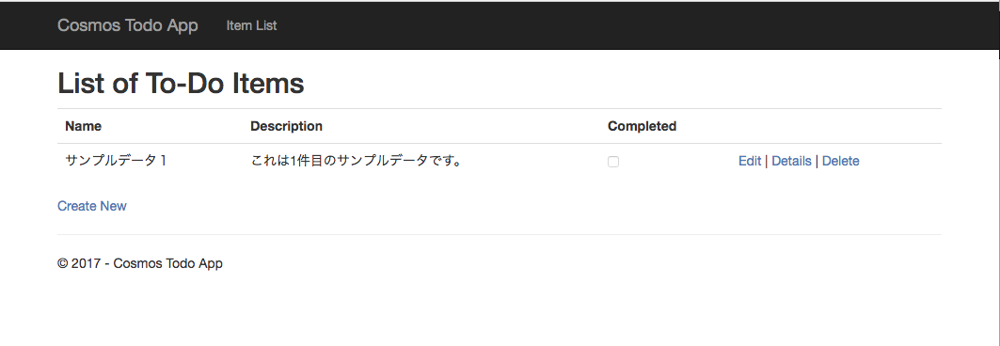

# Visual Studio による Cosmos DB クライアントアプリケーション (.NET Core版)の開発

## 1. 開発環境の確認

このハンズオンに必要な環境は以下の通りです。

* Visual Studio 2017の場合

    * Visual Studio 2017 Community Edition (Proffesional, Enterpriseも可): [ダウンロード](https://www.visualstudio.com/ja/free-developer-offers/)
    * Version 15.5.0以上を推奨
    * ASP.NETとAzure開発用の主要コンポーネントがインストールされていること
    * .NET Core 2系のSDK: [SDKのダウンロード](https://www.microsoft.com/net/download/windows)

* Visual Studio for Macの場合

    * Visual Studio for Mac: [ダウンロード](https://www.visualstudio.com/ja/free-developer-offers/)
    * Version 7.2以上を推奨
    * .NET Core 2系のSDK: [SDKのダウンロード](https://www.microsoft.com/net/download/macos)

### .NET Coreのバージョン確認方法

* コマンドプロンプトまたはターミナルにて以下を実行します。

    ```
    $ dotnet --version
    ```

    ```2.0.0```以上が返ってくれば問題ありません。

## 2. ハンズオン用ソースコードの入手

* Gitで入手する

    * クローンURL: https://github.com/zenarc/aajp1218-todo.git

    プロジェクト保存用ディレクトリに移動して以下を実行して下さい。

    ```
    $ git clone https://github.com/zenarc/aajp1218-todo.git
    ```

* zipをダウンロードする

    * リポジトリ: https://github.com/zenarc/aajp1218-todo

    Githubリポジトリの **clone or download**ボタンから **Download ZIP**を実行し、適当なディレクトリに解凍して下さい。

## 3. Cosmos DBへの接続情報をセットする

1. Azureポータルの**Azure Cosmos DB アカウント** ブレードで **キー** をクリックし以下のCosmos DB接続情報を手元にコピーしておきます。

    * URI: 例) ```https://xxx.documents.azure.com:443/```
    * プライマリ キー: 例) ```xxxxxxxxxxxxxxxxxxxxxxxxxxxxxxxxxxxxxxxxAbcdEfghijKlmn123Ew==```

1. Visual Studioからソースコードのディレクトリにあるソリューションファイル```aajp1218.sln```を開きます。

1. ```appsettings.Development.json```を開き、以下のように接続用の各種文字列を変更して保存します。

    ```
    "AppConfiguration":  {
        "Endpoint": "Azureポータルから取得したURI",
        "Key": "Azureポータルから取得したプライマリキー",
        "DatabaseId": "コレクション作成時に指定したDatabase id",
        "CollectionId": "コレクション作成時に指定したCollection id",
        "REGION_NAME": "Cosmos DBアカウント作成時に指定したリージョン名(※1)"
    }
    ```
    ※1) リージョン名は、 指定された文字列を入れる必要があります。
    * 東日本: ```Japan East```
    * 西日本: ```Japan West```
    * その他: [Azure regions](https://azure.microsoft.com/en-us/regions/)のRegion文字列を使って下さい。

## 4. 動作確認を行う

1. Visual Studioにてデバッグを実行し、ブラウザに以下のような画面が表示されれば問題ありません。

    