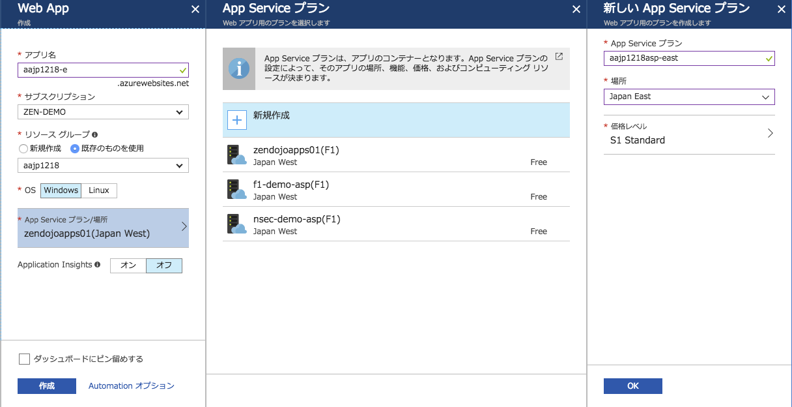
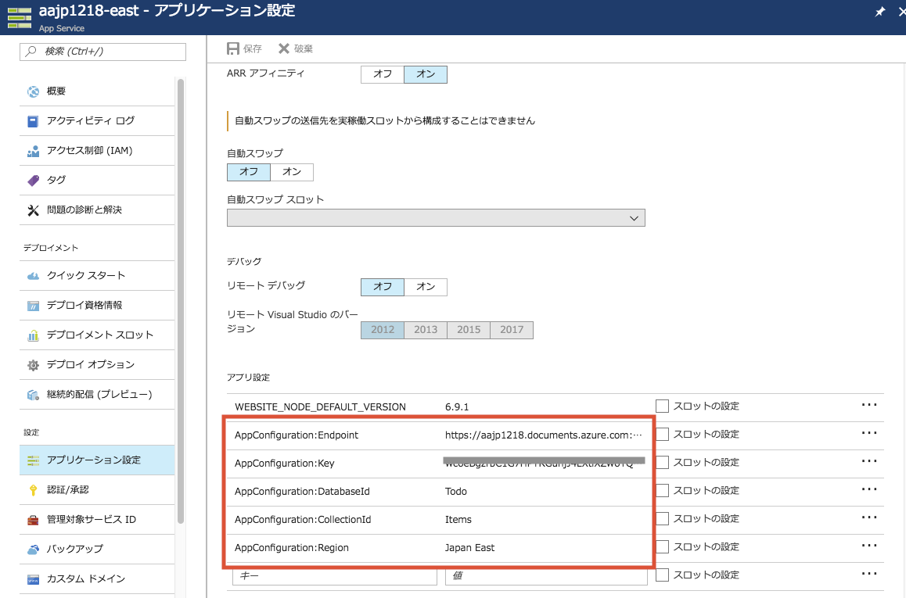

# Module5: アプリケーションの Azure App Service へのデプロイ

## 1. Web Appの作成（プライマリリージョン）

1. Azureポータルにて、 **新規** > **Web + モバイル** > **Web App** をクリックします。

1. Web App作成画面では以下を参考に設定して下さい。

    * アプリ名: 任意の文字列（半角英数小文字とハイフンのみ）
    * サブスクリプション: ハンズオン用に用意したサブスクリプション
    * リソースグループ: [module0](module0.md)で作成したリソースグループを選択（新規作成しない）
    * OS: Windows
    * App Serviceプラン/場所
        - **新規作成** を選択
        - App Serviceプラン: 任意のユニークな文字列（半角英数小文字とハイフンのみ）このIDが接続文字列のURLになる。例）aajp1218-asp-east
        - 場所: Cosmos DBの **書き込みリージョン** と同一リージョン 例）Japan East
        - 価格レベル: S1 Standard (Traffic Managerに対応させるためStandard以上が必須)
    * Application Insights: オフ

    **作成** をクリックします。

    

1. デプロイが完了するまで数分待ちます（続けて2に進んで構いません）。

## 2. Web Appの作成（セカンダリリージョン）

1. Azureポータルにて、 **新規** > **Web + モバイル** > **Web App** をクリックします。

1. Web App作成画面では以下を参考に設定して下さい。

    * アプリ名: 任意の文字列（半角英数小文字とハイフンのみ） ※ プライマリとは別のアプリとして作成
    * サブスクリプション: ハンズオン用に用意したサブスクリプション
    * リソースグループ: [module0](module0.md)で作成したリソースグループを選択（新規作成しない）
    * OS: Windows
    * App Serviceプラン/場所
        - **新規作成** を選択
        - App Serviceプラン: 任意のユニークな文字列（半角英数小文字とハイフンのみ）例）aajp1218-asp-west
        - 場所: Cosmos DBの **読み取りリージョン** と同一リージョン 例）Japan West
        - 価格レベル: S1 Standard (Traffic Managerに対応させるためStandard以上が必須)
    * Application Insights: オフ

    **作成** をクリックします。

1. デプロイが完了するまで数分待ちます。

## 3. Web Appの設定（プライマリ、セカンダリ両方）

Web AppからCosmos DBに接続するための情報を設定します。プライマリリージョンとセカンダリリージョンのWeb App両方に設定して下さい。

1. **App Service** ブレードにて、 **アプリケーション設定** をクリックします。

1. アプリケーション設定画面の **[アプリ設定]** で以下のようキーと値を追加して下さい。

    * AppConfiguration:Endpoint - Azureポータルから取得したURI
    * AppConfiguration:Key - Azureポータルから取得したプライマリキー
    * AppConfiguration:DatabaseId - コレクション作成時に指定したDatabase id
    * AppConfiguration:CollectionId - コレクション作成時に指定したCollection id
    * AppConfiguration:Region - Web Appをデプロイしているリージョン名 **(プライマリ、セカンダリで異なります)**

    

1. **保存** アイコンをクリックします。

## 4. Web Appのデプロイ（プライマリ、セカンダリ両方）

以下のステップをプライマリリージョンとセカンダリリージョンのWeb Appに対してそれぞれ1回ずつ実行して下さい。

1. Visual Studioでデプロイするソリューションを開きます。

1. デプロイするプロジェクトを右クリックし > **[発行]** をクリックします。

1. 発行画面で **Microsoft Azure App Service**を選択し、 **[既存のものを選択]** を選んで、 **[発行]** をクリックします。

1. **[アカウントの追加]** をクリックし、Azure サブスクリプションにサインインします。 既にサインインしている場合は、目的のサブスクリプションを含んだアカウントをドロップダウンから選択します。

1. **[サブスクリプション]** を選択すると、先ほど作成したWeb Appを選択できるので、デプロイしたいWeb App名を選択（ **ここでプライマリとセカンダリのどちらかを選ぶ** ）した状態にして、 **[OK]** をクリックします。

1. デプロイが完了するまで数分待ちます。

1. デプロイ後、ローカルデバッグ時と同様の画面が表示されれば問題ありません。

---
[Back](module4.md) | [Next](module6.md)