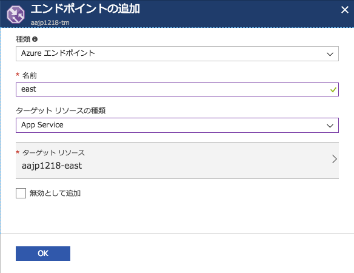

# Module6: Traffic Managerを導入してアプリケーションをディザスタリカバリー対応にする

## 1. Traffic Managerの作成

1. Azureポータルにて、 **新規** > **ネットワーキング** > **Traffic Manager プロファイル** をクリックします。

1. Traffic Manager プロファイル作成画面では以下を参考に設定して下さい。

    * 名前: 任意の文字列（半角英数小文字とハイフンのみ）
    * ルーティング方法: パフォーマンス
    * サブスクリプション: ハンズオン用に用意したサブスクリプション
    * リソースグループ: [module0](module0.md)で作成したリソースグループを選択（新規作成しない）

    **作成** をクリックします。

## 2. Traffic Managerエンドポイントの設定

以下の手順でWeb Appのプライマリリージョンとセカンダリリージョンをエンドポイントとしてそれぞれ追加します。

1. **Traffic Manager プロファイル** ブレードにて、 **エンドポイント** > **[追加]** をクリックします。

    * 種類: Azureエンドポイント
    * 名前: 任意の文字列（半角英数小文字とハイフンのみ）
    * ターゲットリソースの種類: App Service
    * ターゲットリソース: プライマリリージョンとセカンダリリージョンのWeb Appどちらかを選択

    **OK** をクリックします。

    

## 3. Traffic Managerを経由したアプリケーションへのアクセス

1. **Traffic Manager プロファイル** ブレードにて、 **概要** をクリックします。

1. エンドポイントが両方ともオンラインになっていることを確認します。

1. **[DNS 名]** のURLをクリックして、アプリケーションにアクセスします。

1. App Service個別のURLにアクセスした時と同じ画面が表示されれば問題ありません。

## Op. 障害発生のシミュレーション

1. Cosmos DBを手動フェールオーバーしても、Traffic Manager経由でのアプリケーション利用に問題がないことを確認します。

1. Cosmos DBの読み取りリージョンを削除しても、Traffic Manager経由でのアプリケーション利用に問題がないことを確認します。

1. App Serviceのプライマリリージョンまたはセカンダリリージョンのどちらかを停止／削除しても、、Traffic Manager経由でのアプリケーション利用に問題がないことを確認します。